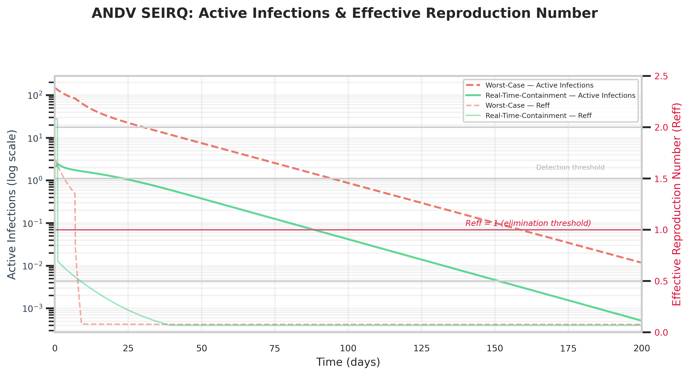

<div align="center">

# 🌍 Language / 语言 / Idioma / Langue / Sprache

[English](README.md) | [简体中文](README_ZH.md) | [Español](README_ES.md) | [Français](README_FR.md) | [Deutsch](README_DE.md)

---
</div>

<div align="center">

# 🧬 Modèle SEIRQ Comportemental Dynamique pour l'Épidémie d'ANDV via OSINT Agentique

[](https://www.python.org/)
[](LICENSE)
[](https://github.com/)
[](https://scipy.org/)

**Une compétence (Skill) IA « plug-and-play » pour la simulation épidémiologique basée sur l'OSINT — calibrée avec des renseignements en temps réel sur l'épidémie d'ANDV du MV Hondius (Mai 2026).**

<p align="center">
  
</p>

</div>

---

## Résumé / TL;DR

> [!IMPORTANT]
> **Constat clé :** Les preuves du monde réel — transfert militaire aérien vers l'hôpital Gómez Ulla (Madrid), isolement individuel en chambre à pression négative (UAAN), protocole de surveillance de 42 jours et 60–90 professionnels de santé dédiés — suppriment le taux de reproduction effectif ($R_{eff}$) sous le seuil d'élimination **en 5 jours**, rendant la fermeture des frontières Schengen épidémiologiquement inutile. Sans ce calibrage basé sur l'OSINT, les modèles standard surestiment l'ampleur de l'épidémie de **deux ordres de grandeur**.

Ce dépôt présente un **modèle compartimental dynamique SEIRQ** pour le **Virus des Andes (ANDV)** — la seule variante d'hantavirus avec une transmission interhumaine confirmée — alimenté par **l'OSINT agentique** (collecte d'actualités en temps réel). Le modèle intègre l'**économie comportementale** (élasticité de panique, $\alpha = 0,65$) et les **interventions politiques en fonction d'échelon** dans un cadre classique d'équations différentielles ordinaires (EDO).

### Comparaison des Scénarios : Épidémie du MV Hondius

| Scénario | Graines Initiales | Délai Politique | Efficacité Quarantaine | Pic Actif | Reff < 1,0 | Fermeture Schengen ? |
| :--- | :---: | :---: | :---: | :---: | :---: | :---: |
| **Pire Cas (A)** | 150 | 7 jours | 30% | ~150 | Jour 7 | **Oui ❌** |
| **Contrôle Temps Réel (B)** | 16 | **1 jour 🚁** | **95% 🏥** | **~3** | **Jour 5** | **Non ✅** |

---

## Méthodologie

### Architecture du Modèle

Nous implémentons un **système d'EDO SEIRQ à cinq compartiments** :

$$
\text{Susceptibles (S)} \xrightarrow{\beta(t)} \text{Exposés (E)} \xrightarrow{\sigma} \text{Infectieux (I)} \xrightarrow{\gamma} \text{Rétablis (R)}
$$
$$
I \xrightarrow{q(t)} \text{Quarantaine (Q)}
$$

#### Équations des Compartiments

$$
\frac{dS}{dt} = -\beta(t) \cdot \frac{S \cdot I}{N}
$$

$$
\frac{dE}{dt} = \beta(t) \cdot \frac{S \cdot I}{N} - \sigma E
$$

$$
\frac{dI}{dt} = \sigma E - \gamma I - q(t) I
$$

$$
\frac{dR}{dt} = \gamma I
$$

$$
\frac{dQ}{dt} = q(t) I
$$

#### Modulation Comportementale via l'Élasticité de Panique

Le taux de transmission effectif est atténué par la prise de conscience publique cumulée (autorégulation de la distanciation sociale) :

$$
\beta_{\text{eff}}(t) = \beta_0 \cdot \max\!\left(0,10,\; 1 - \alpha \cdot \frac{Q(t)}{0,01N}\right),\quad \alpha = 0,65
$$

Le taux de détection et de quarantaine s'active après un délai politique $\tau$ :

$$
q(t) = 
\begin{cases} 
\eta_q \cdot 0,3, & t \geq \tau \\ 
0, & t < \tau 
\end{cases}
$$

#### Paramètres Épidémiologiques (Spécifiques à l'ANDV)

| Paramètre | Valeur | Source |
| :--- | :---: | :--- |
| Nombre de reproduction de base $R_0$ | 2,12 | Littérature transmission ANDV (humain-humain) |
| Période d'incubation (médiane) | 21,0 jours | Plage clinique de 1 à 6 semaines |
| Période infectieuse | 7,0 jours | Estimation standard pour les hantavirus |
| Élasticité de panique $\alpha$ | 0,65 | Calibré en économie comportementale |
| Population modélisée $N$ | 1 000 | Navire + groupe initial de contacts |

*(Note : La population initiale $N=1 000$ est calibrée pour la Phase d'ensemencement de l'incident du navire de croisière. Comme le modèle utilise des réseaux de contact indépendants de la densité, la mise à l'échelle de $N$ permet une généralisation fluide aux prévisions macro, comme la région métropolitaine de Madrid.)*

---

## Pipeline OSINT (Renseignement → Paramètres)

Le scénario de « Contrôle en Temps Réel » a été calibré dynamiquement à partir de 20 articles d'actualité collectés détaillant l'incident du MV Hondius :

| Extraction de Renseignement | Paramètre du Modèle |
| :--- | :--- |
| 14 ressortissants espagnols isolés + 2 contacts tracés (Alicante, Barcelone) | $E_0 = 16$ |
| Transfert militaire aérien vers Madrid en moins de 24 heures | $\tau = 1,0$ jour |
| Isolements UAAN individuels à l'hôpital Gómez Ulla | $\eta_q = 0,95$ |
| Protocole de surveillance de 42 jours, 60–90 soignants dédiés | Application soutenue de la quarantaine |
| Épidémiologiste de l'OMS à bord du vol d'évacuation | Coordination internationale vérifiée |

---

## Intégration Agentique — Utilisation comme Compétence IA

Ce code est conçu pour être ingéré par les **systèmes LLM agentiques** comme une compétence OSINT dynamique.

### 1. Charger comme Compétence Contextuelle

Copiez la logique de `skill/` ou `scripts/andv_ode_solver.py` dans le répertoire d'outils de votre agent. Demandez à votre agent :

> *« Exécute l'outil d'Évaluation des Risques ANDV en utilisant les dernières données OSINT de 16 graines et un délai politique de 1 jour. Projette la demande de capacité hospitalière pour Madrid la semaine prochaine. »*

### 2. Mises à Jour Bayésiennes Séquentielles

Les modèles traditionnels reposent sur des priors statiques. Ce système prend en charge une mise à jour postérieure continue :

```text
Prior (A priori) :   Paramètres du pire cas (E0=50, I0=150, tau=7,0)
                            ↓
Synchronisation OSINT : L'agent collecte 20 articles d'actualité en temps réel
                            ↓
Postérieur :         16 graines, 1 jour de délai, 95% d'efficacité de quarantaine
                            ↓
Décision :           Reff < 1,0 au Jour 5 → La fermeture des frontières N'est PAS nécessaire
```

---

## Démarrage Rapide (Quick Start)

### Prérequis

* Python 3.10+
* `pip`

### Installation et Exécution

```bash
# 1. Cloner le dépôt
git clone https://github.com/kunkunz420/ANDV-Behavioral-SEIRQ.git
cd ANDV-Behavioral-SEIRQ

# 2. Environnement virtuel
python3 -m venv venv
source venv/bin/activate

# 3. Installer les dépendances
pip install -r requirements.txt

# 4. Exécuter le solveur (génère results/andv_trajectories.csv)
python scripts/andv_ode_solver.py

# 5. Générer les graphiques
python scripts/plot_generator.py

```

### Sortie Attendue

```text
[OK] Trajectories written → results/andv_trajectories.csv
[OK] Summary written → results/scenario_comparison.txt
[OK] Loaded 4,002 rows from results/andv_trajectories.csv
[OK] Chart saved → results/active_vs_reff.png
[OK] Chart saved → results/quarantine_vs_recovered.png

```

---

## Personnalisation des Paramètres

Tous les paramètres clés sont définis en haut de `scripts/andv_ode_solver.py`. Modifiez-les pour vos propres simulations régionales ou pathogènes :

```python
# ── Constantes épidémiologiques centrales ──
R0 = 2.12                  # Nombre de reproduction de base
INCUBATION_PERIOD = 21.0   # Jours
INFECTIOUS_PERIOD = 7.0    # Jours
N = 1000                   # Population initiale

# ── Paramètres comportementaux et politiques ──
ALPHA = 0.65               # Élasticité de panique [0, 1]
ETA_Q = 0.95               # Efficacité de la quarantaine [0, 1]
TAU = 1.0                  # Délai politique (jours)

```

**Exemples de Personnalisation :**

* **Grippe saisonnière :** `R0 = 1,3`, `INCUBATION_PERIOD = 1,4`, `INFECTIOUS_PERIOD = 5,0`
* **Réponse tardive (région en développement) :** `TAU = 14,0`, `ETA_Q = 0,40`
* **Haute conformité publique (contexte asiatique) :** `ALPHA = 0,85`, `ETA_Q = 0,90`

---

## Structure du Dépôt

```text
├── data/                    # Données OSINT brutes et traitées
├── scripts/
│   ├── andv_ode_solver.py   # Solveur EDO SEIRQ
│   └── plot_generator.py    # Générateur de graphiques académiques
├── skill/                   # Interface d'outil pour Agents IA
├── results/                 # Résultats de simulation
│   ├── andv_trajectories.csv
│   ├── scenario_comparison.txt
│   ├── active_vs_reff.png
│   └── quarantine_vs_recovered.png
├── .gitignore
├── requirements.txt
├── README.md                # English
├── README_ZH.md             # Chinese (简体中文)
├── README_ES.md             # Spanish (Español)
├── README_FR.md             # French (Français)
└── README_DE.md             # German (Deutsch)
```

---

## Citation

```bibtex
@software{andv_seirq_behavioral_2026,
  author = {Kun and the Hermes Agent Team},
  title = {Dynamic Behavioral SEIRQ Model for ANDV Outbreak via Agentic OSINT},
  year = {2026},
  url = {https://github.com/kunkunz420/ANDV-Behavioral-SEIRQ}
}

```

---

## Licence

MIT License — voir [LICENSE](https://www.google.com/search?q=LICENSE).

---

*Une Compétence IA Plug-and-Play pour la Modélisation Épidémiologique Pilotée par l'OSINT*
